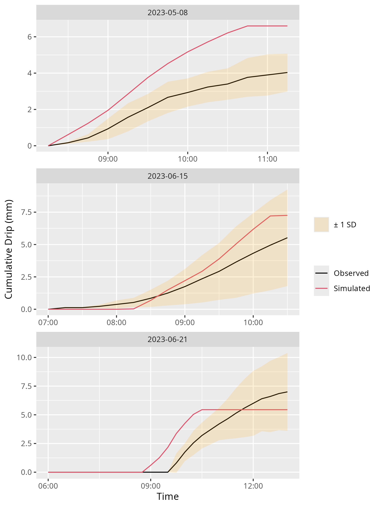
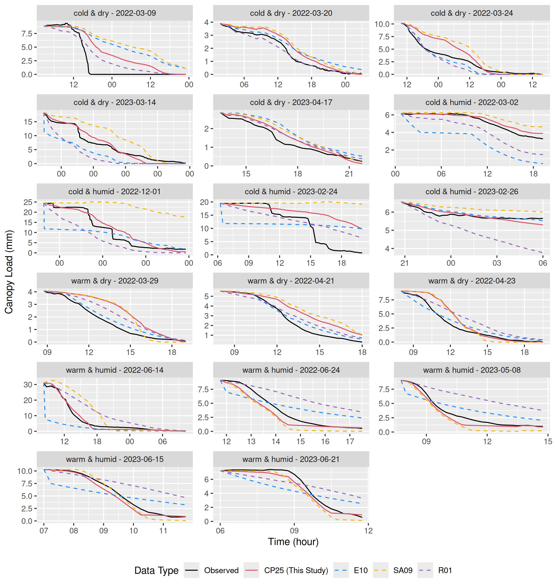
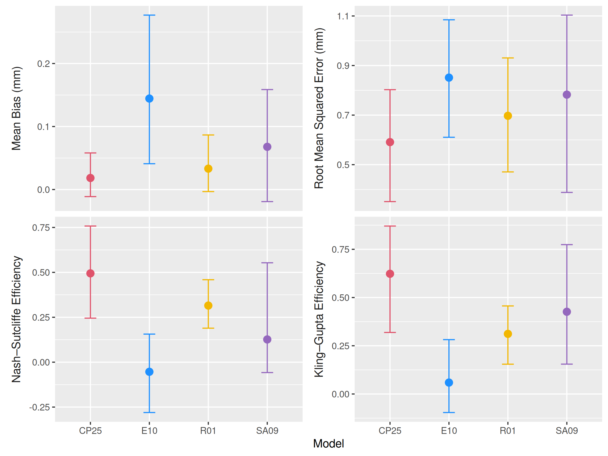
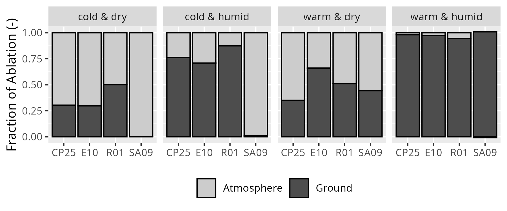

<!-- \setstretch{1.5}  -->

```{r, include=FALSE, warning=FALSE}
knitr::opts_chunk$set(echo = FALSE, message=FALSE, warning=FALSE, fig.align='center')
source('scripts/get-manuscript-values.R')
```

<!-- NOTE: Commented sections below are for docx format -->
::: {custom-style="Affiliation"}
^1^Centre for Hydrology, University of Saskatchewan, Canmore, Canada
:::

::: {custom-style="Correspondence"}
**Corresponding author**: Alex C. Cebulski (alex.cebulski@usask.ca)
:::

**Key Points:**

-   Unloading was found to be strongly associated with canopy snow load, wind shear stress, and canopy snowmelt.
-   Implementation of a new model that includes both melt and dry-snow unloading processes improved canopy snow load predictions.
-   The fraction of snowfall sublimated in the canopy differed by up to a factor of three across existing models.

::: {custom-style="Abstract"}
**Abstract**

Interception and ablation of snow in forest canopies significantly influence the quantity, timing, and phase of precipitation that reaches the ground in cold regions forests. Yet current modelling approaches have uncertain transferability across differing climate and forest types. Here, in-situ observations from a needleleaf forest in the Canadian Rockies are utilised to evaluate the theories underpinning existing canopy snow ablation models and develop a novel understanding supporting the development of a new canopy snow ablation model. The observations revealed that canopy snow load, wind shear stress, and canopy snowmelt were strongly associated with unloading; however, air temperature and sublimation were not. A new canopy snow ablation model was developed based on these associations and their impact on the canopy snow energy and mass balance. This model demonstrated improved performance in simulating canopy snow load compared with previous approaches, especially during melt- and wind-dominated ablation events. The improved performance in representing canopy snow load compared to existing models results from the inclusion of a comprehensive representation of the mass and energy balance of intercepted snow. In contrast, all existing canopy snow models were found to omit key processes which limited the accuracy of simulated snow load and partitioning of intercepted snow. The inclusion of the updated canopy snow mass and energy balance led to improved simulations of intercepted snowfall ablation and partitioning across a wide range of meteorologies compared to existing approaches.

:::

# Introduction

The seasonal snowpack is an essential component of global water resources [@Immerzeel2020; @Viviroli2020] and is increasingly threatened by rapid climate and land cover change [@Lopez-Moreno2014; @Szczypta2015; @Fang2023; @Aubry-Wake2023]. Vegetation cover can significantly alter the quantity, phase, and timing [@Pomeroy1995; @Essery2003; @Sanmiguel-Vallelado2020; @Rojas-Heredia2024; @Mazzotti2021; @Ellis2010; @Safa2021] of snowfall reaching the ground. Snow falls in forests over half of the Northern Hemisphere [@Kim2017] and over 23% of the global landmass [@Deschamps-Berger2025], making forest-snow interactions crucial to understand for informed ecological, land management, and water resource decision-making. Needleleaf canopies are particularly effective at intercepting snowfall [@Pomeroy1993a; @Hedstrom1998; @Storck2002; @Cebulski2025a], where intercepted snow is subject to increased energy inputs relative to the subcanopy snowpacks, leading to increased rates of melt, unloading, and/or sublimation [@Pomeroy1998b; @Parviainen2000; @Storck2002; @Roesch2001]. The partitioning of snow to the atmosphere via sublimation [@Pomeroy1998b; @Parviainen2000] or to the ground through unloading and meltwater drip [@Storck2002; @Roesch2001; @Lumbrazo2022] is highly sensitive to meteorological conditions and forest structure, contributing to differing process emergence and substantial variability in subcanopy snow accumulation. Coastal humid environments typically exhibit small sublimation losses and a larger influence of unloading and melt [@Storck2002; @Floyd2012]. Here, enhanced canopy energy inputs combined with high humidity increase both solid snow unloading and melt of snow intercepted in the canopy [@Lumbrazo2022; @Lundquist2021; @Roesch2001]. High liquid water contents during rapid melt can lubricate the snow attachment to the canopy and weaken cohesive bonds, inducing unloading, much as for wet snow avalanches [@Baggi2008]. Conversely, the colder and drier winters in continental climates typical of the boreal forests can induce substantial canopy sublimation losses [e.g., 25–45% of annual snowfall in @Essery2003] in addition to unloading [@Pomeroy1998b; @Parviainen2000; @Essery2003; @Gelfan2004; @Pomeroy2002]. As a result, reliable models of snow accumulation and streamflow in forested basins rely on a comprehensive understanding of interception processes [@Wheater2022; @Essery2003; @Pomeroy1998c; @Clark2015b; @Verseghy2017].

Canopy snow models have demonstrated variable transferability across different climates and forest types [@Essery2003; @Gelfan2004; @Lundquist2021; @Lumbrazo2022], which has been attributed to limiting the performance in predicting forest snowpacks in hydrological model intercomparisons [@Rutter2009; @Krinner2018]. Recent studies have emphasised the importance of distinguishing between initial snow interception and subsequent ablation processes [@Cebulski2025; @Cebulski2025a]. This separation allows for individual parameterisations for distinct processes, improving both process representation and the modular design of contemporary models, thereby supporting broader applicability across diverse environments and model structures [@Clark2015b; @Pomeroy2022]. In addition, @Lundquist2021 and @Cebulski2025a demonstrated that canopy snow processes can be more accurately represented without the concept of a maximum canopy snow load, which is included in initial accumulation parameterisations [@Hedstrom1998; @Andreadis2009]. Moreover, existing canopy snow accumulation parameterisations often incorporate ablation routines, likely because ablation is included in measurements of interception efficiency [@Schmidt1991; @Hedstrom1998; @Katsushima2023; @Cebulski2025]. For example, @Hedstrom1998 found that interception efficiency declined as the canopy is loaded with snow, while @Storck2002 found a constant interception efficiency of 0.6, and is also typically combined with a maximum canopy snow load. Consequently, both the @Hedstrom1998 and @Storck2002 parameterisations have significantly lower interception efficiencies—prior to canopy snow ablation—compared to the observations by @Cebulski2025a. @Staines2023 and @Cebulski2025a show that interception efficiency is best predicted by canopy density alone—consistent with some rainfall interception parameterisations [e.g., @Valante1997; @Zhong2022]—and that snow load has a small influence on canopy density, challenging the @Hedstrom1998 and @Storck2002 initial snow interception theories. Together, these studies [@Cebulski2025; @Cebulski2025a; @Lundquist2021] emphasise the need to revisit canopy snow ablation parameterisations.

Unloading of intercepted snow to the ground has previously been shown to be associated with air temperature [@Roesch2001; @Katsushima2023; @Schmidt1990], ice-bulb temperature—which more accurately represents the cooling effect of sublimation compared to air temperature—[@Ellis2010; @Floyd2012], canopy snowmelt rate [@Storck2002], and wind speed (see Supporting Information for example relationships). Each of these factors was also found to be dependent on canopy snow load and time. While @Hedstrom1998 did not make direct observations of canopy snow unloading, they proposed a parameterisation based on canopy snow load and time. In addition to the empirical observations by the aforementioned studies, physical reasoning also supports the inclusion of these processes. For example, melt promotes unloading through loss of structural integrity, particle bond weakening, and lubrication of intercepted snow. Wind drag promotes unloading through shear stress applied to intercepted snow, wind erosion through entrainment of intercepted snow into the atmosphere, and branch movement. Branch elasticity increases with temperature [@Schmidt1990], which can increase the likelihood of unloading due to increased branch angle under snow loads and increase branch movement during wind gusts [@Raleigh2022]. 

Melt of snow intercepted in the canopy is typically represented by either an energy balance approach [e.g., @Parviainen2000; @Clark2015b; @Andreadis2009; @Essery2025], as a function of air temperature [@Roesch2001], or a function of ice-bulb temperature [@Ellis2010; @Floyd2012]. Sublimation is generally represented using a coupled energy-mass balance approach [e.g., @Essery2003; @Verseghy2017; @Pomeroy1998b]. The @Essery2003 and @Pomeroy1998b approaches differ in that @Pomeroy1998b does not include longwave radiation in the canopy snow energy balance. Both the @Essery2003 and @Pomeroy1998b parameterisations decrease the latent heat flux from snow intercepted in the canopy as the canopy fills up with snow and its specific surface area decreases. These parameterisations rely on prescribed values of maximum canopy snow load, which represents the amount of snow held by the canopy before all additional snow unloads. However, such estimates have been shown to underestimate true maxima [@Storck2002; @Lundquist2021; @Cebulski2025a] and should be reconsidered using a larger maximum load or an approach that avoids prescribing a maximum load. The merits of using more physically based energy balance methods rather than empirically based functions to calculate snowmelt and sublimation have not been directly assessed through an event-based process investigation. Some models vertically discretise the canopy into multiple layers [e.g., @Clark2015b] or into two layers [e.g., @Essery2025] to better capture vertical gradients in the canopy energy balance—for instance, enhanced solar radiation and turbulent exchanges near the canopy top relative to the lower canopy. However, uncertainties in generating forcing data at different canopy heights can limit the effectiveness of these multi-layer approaches. In contrast, other schemes represent the canopy as a single layer [@Pomeroy2022; @Verseghy2017].

Quantifying individual canopy snow ablation processes, including unloading, wind redistribution, melt, drip, and sublimation remains challenging, even with sophisticated lysimetry [@Storck2002] and eddy-covariance systems [@Harding1996; @Conway2018; @Harvey2025]. Consequently, some canopy snow ablation parameterisations have been developed using methods, such as above canopy albedo, that do not distinguish individual processes [@Roesch2001; @Bartlett2015]. While these approaches offer useful indices of model performance, they provide limited insight into the accuracy of individual process representations. Lysimeter-based measurements offer more direct process-level observations, but their interpretation can be made uncertain by freeze-thaw cycles and concurrent processes [@Storck2002; @Floyd2012; @MacDonald2010]. A hybrid diagnostic approach that combines individual process measurements with simulations and employs observations such as canopy snow load from a weighed tree has yet to be applied, but is explored in this study. 

The objective of this study is to better understand and predict the influences of meteorology and snow load on intercepted snow ablation. This study specifically examines canopy snow ablation following snowfall and initial interception. @Cebulski2025a has addressed processes governing the initial accumulation of snow in the canopy.

The specific research questions this research aims to address include:

1. How do snow load, air temperature, humidity, wind exposure, canopy snow sublimation, and snowmelt influence the rate of canopy snow unloading?

2. To what extent do current theoretical models of canopy snow ablation align with detailed in-situ observations?

3. What modifications to existing models are necessary to accurately represent ablation of snow intercepted in the canopy, and what is the improvement in performance from these modifications?

# Methods

## Study Site

The observations presented in this study were collected at Fortress Mountain Research Basin (FMRB), Alberta, Canada, -115° W, 51° N, a continental headwater basin in the Canadian Rockies. The site is located 2100 m above sea level on a ridge covered by mature subalpine fir (*Abies lasiocarpa*) and Engelmann spruce (*Picea engelmannii*) forest. Air temperature, humidity, and wind speed were measured at a height of 4.3 m at Forest Tower Station (@fig-site-map). Shear stress was calculated using the EddyPro software (LI-COR Biosciences) based on high-frequency wind measurements from a CSAT3 three-dimensional sonic anemometer (Campbell Scientific) installed at 3.0 m at Forest Tower station. The CSAT3 was occasionally covered in snow during the analysis period, and thus to provide a complete record of shear stress, a linear relationship was established between shear stress derived from the CSAT3 and the square of wind speed measured at 4.3 m at the Forest Tower station (*R^2^* = 0.71, *p* < 0.05). This relationship was then used to fill gaps in shear stress measurements during periods when the CSAT3 was snow-covered. The precipitation rate was measured by an Alter-shielded OTT Pluvio weighing precipitation gauge installed 2.6 m above ground at the adjacent Powerline Station (@fig-site-map). Incoming and outgoing solar radiation was measured by a Kipp & Zonen CNR4 4-Component Net Radiometer installed 3.27 m above the ground at Fortress Ridge Station, 2.0 km to the northwest of Forest Tower station (50.8° N, 115.2° W). This wind-exposed site was selected to reduce snow accumulation on the radiometers, in addition to the CNR4's built-in heating element. Three subcanopy lysimeters, consisting of plastic horse-watering troughs with an opening of 0.9 m^2^ and depth of 20 cm suspended from a load cell, were installed to measure subcanopy snow accumulation. A weighed tree lysimeter (subalpine fir) suspended from a load cell (Artech S-Type 20210-100) measured the weight of canopy snow load (kg) and was scaled to an areal estimate of snow load (mm) using snow surveys as in @Pomeroy1993a. To isolate subcanopy lysimeter measurements of canopy snow unloading from throughfall, 15-minute intervals with no atmospheric precipitation were selected based on precipitation measurements at Powerline. The weighed tree and time-lapse imagery were also used to confirm the absence of atmospheric precipitation and to identify periods when snow was intercepted in the canopy and ablation was possible. Four tipping bucket rain gauges—3 Texas Electronics TR-525M and 1 Hyquest Solutions TB4MM—were installed along a 15 m transect adjacent to the dense canopy subcanopy lysimeter to quantify sub-canopy drip from melting intercepted snow. Additional details on this study site and the meteorological and lysimeter measurements have been described in @Cebulski2025a.

{#fig-site-map}

## The Cold Regions Hydrological Model Platform

The Cold Regions Hydrological Model Platform (CRHM) was used to implement calculations of the canopy snow energy and mass budget. A full description of the CRHM platform is described in @Pomeroy2022, and the source code is available at https://github.com/srlabUsask/crhmcode. The climate forcing data used to run CRHM were provided from station-based fifteen-minute interval measurements of air temperature, relative humidity, wind speed, precipitation, and incoming solar radiation from the station measurements. CRHM incorporates a flexible modular design allowing the user to select various parameterisations that represent hydrological processes. The phase of atmospheric precipitation was determined from the energy balance of falling hydrometeors [@Harder2013]. A new CRHM module was created here to simulate the coupled mass and energy balance of snow intercepted in the canopy. The energy balance is described in detail in @sec-ebal, and the updates to the mass balance through revisions to the canopy snow unloading empirical functions are presented in @sec-dry-unld and @sec-melt-unld. Due to uncertainties in estimating model forcing data and measuring canopy snow ablation at varying canopy heights, a single-layer canopy snow model was implemented in CRHM.

## Canopy Snow Mass Balance {#sec-mbal}

The following mass balance, as described in @Cebulski2025 was implemented in CRHM to track the state of canopy snow load ($L$, mm) over time:

$$
\frac{dL}{dt} = 
[q_{sf} - q_{tf} + q_{ros}] - [q_{unld}^{melt} + q_{unld}^{dry}] - q_{drip} - q_{wind}^{veg} - q_{sub}^{veg}
$$ {#eq-canopy-mass-bal}

where $\frac{dL}{dt}$ is the change in canopy snow load over time, (mm s^-1^), $q_{sf}$ is the snowfall rate (mm s^-1^), $q_{tf}$ is the throughfall rate (mm s^-1^), $q_{ros}$ is the rate of rainfall falling on snow intercepted in the canopy (mm s^-1^), $q_{unld}^{melt}$ is the unloading rate due to melt (mm s^-1^), $q_{unld}^{dry}$ is the dry-snow unloading rate due to shear stress on snow, wind erosion, branch movement, structural degradation, bond weakening and increased elasticity of branches and other non-melt related processes (mm s^-1^), $q_{drip}$ is the canopy snow drip rate (mm s^-1^) resulting from canopy snowmelt ($q_{melt}^{veg}$, mm s^-1^), $q_{wind}^{veg}$ is the wind transport rate in or out of the control volume (mm s^-1^), and $q_{sub}^{veg}$ is the intercepted snow sublimation rate (mm s^-1^) which also includes evaporation of liquid water in the canopy. Figure 1 in @Cebulski2025 presents a visual representation of this mass balance.

## Mass Balance Parameterisations

In addition to the updated canopy snow model presented in this study, hereafter referred to as CP25 (described in @sec-dry-unld and @sec-melt-unld), three other canopy snow models were implemented in CRHM following previous studies by @Ellis2010 and @Floyd2012 (E10), @Roesch2001 (R01), and @Andreadis2009, who built on observations by @Storck2002 (SA09) (@tbl-model-desc). The E10 model includes canopy snow sublimation as described in @Pomeroy1998b, dry-snow unloading as a function of canopy snow load from @Hedstrom1998 with modifications described in @Ellis2010 and @Floyd2012 to handle canopy snow melt and drip processes using an ice-bulb temperature threshold. The R01 model represents dry-snow unloading, melt, and drip using linear functions of wind speed and air temperature, while sublimation is simulated using the parameterisation from @Pomeroy1998b. The SA09 model unloads snow as a fraction of the canopy snowmelt rate, following observations by @Storck2002, and does not include dry-snow unloading. The snowmelt rate from @eq-eb was used to calculate the unloading rate for the @Andreadis2009 unloading and thus differs from the energy balance routine described in their study. Canopy snow sublimation in SA09 was represented using the @Essery2003 parameterisation (@eq-ql) as implemented in CP25.

```{r}
#| label: tbl-model-desc
#| tbl-cap: "Description of canopy snow unloading parameterisations."
#| tbl-colwidths: [6, 20, 34, 38]


tbl <- read.csv("figs/final/table1.csv")

tbl |> knitr::kable(
    col.names = c(
    "Name",
    "Study",
    "Dry-Snow Unloading ($q_{unld}^{dry}$)",
    "Melt Induced Unloading ($q_{unld}^{melt}$)"
  )
)

```

The retention of canopy snow meltwater differs across the four canopy snow models implemented in CRHM. For E10, liquid meltwater is not retained in the canopy and immediately drips before it can evaporate. The R01 model also does not account for evaporation of liquid meltwater, as canopy snow is not explicitly separated into solid snow unloading and melt/drip. The canopy liquid water storage capacity ($L_{max}^{liq}$, mm) from SA09 and CP25 was calculated as:

$$
L_{max}^{liq} = Lh + cLAI
$${#eq-liq-hold-cap}

where $h$ is the liquid meltwater holding capacity that the canopy can retain against gravity and $n$ is a storage constant of the vegetation elements. @Andreadis2009 estimated $h$ as 0.035 (-) and $n$ as $e^{-4}$. In this study, $h$ was set to 0.01 (-), and $c$ was defined as $C_c\cdot 0.2$. A one-sided effective plant (leaf) area index (LAI) was used, including the clumping factor to account for needleleaf canopy structures, following the approach of @Ellis2010 for rainfall interception.

## Canopy Snow Energy Balance {#sec-ebal}

The CP25 and SA09 canopy snow models implemented the following energy balance approach to calculate the energy available for melting snow intercepted in the canopy ($Q_{melt}$, W m^-2^) and to track the canopy snow temperature over time ($\frac{\Delta T_{vs}}{\Delta t}$, K s^-1^). The energy balance is expressed as:

$$
Q_{melt} = 
Q_{sw} +
Q_{lw} +
Q_{p} + Q_{h} + Q_{l} - [C_p^{ice} L \frac{\Delta T_{vs}}{\Delta t}]
$$ {#eq-eb}

where $Q_{sw}$ and $Q_{lw}$ (W m^-2^) are the net shortwave and longwave radiation heat fluxes to the canopy snow, $Q_p$ (W m^-2^), is the advective energy rate, and $Q_{l}$ and $Q_{h}$ (W m^-2^), are the turbulent fluxes of latent heat and sensible heat respectively (positive towards canopy snow), and $C_p^{ice}$ (J kg^-1^ K^-1^) is the specific heat capacity of ice. Figure 2 in @Cebulski2025 illustrates this energy balance.

## Energy Balance Parameterisations

The E10 and R01 parameterisations relied on physically guided relationships to simulate sublimation and melt of intercepted and are described in full detail in their respective articles and summarised in @Cebulski2025. The following section describes the energy balance parameterisations implemented in the CP25 and SA09 models.

$Q_{sw}$ was determined as:

$$
Q_{sw} = Q_{sw}^{in} \cdot (1 - \alpha_s) \cdot \tau_{50}^{veg}
$$ {#eq-sw}

where $Q_{sw}^{in}$ is the downwelling shortwave radiation (W m^-2^), $\alpha_s$ is the albedo of snow intercepted in the canopy (-), $\tau_{50}^{veg}$ (-) is the canopy transmittance to $Q_{sw}^{in}$. Equation 10 from @Pomeroy2009 was used to determine $\tau_{50}^{veg}$, using half of the leaf area index (LAI) based on studies by @Weiskittel2009 and @Kesselring2024, which indicate that approximately 50% of the total leaf area is concentrated in the upper half of coniferous canopies. $Q_{sw}$ provides an approximation of the net shortwave radiation to all snow intercepted in the canopy and is a simplification from using a partial differential equation to determine the radiation incident on individual height layers within the canopy. Upwelling shortwave radiation reflected off the surface snowpack is considered a negligible contribution to the snow intercepted in the canopy, as it is primarily blocked by vegetation elements underlying the canopy snow [@Pomeroy2009]. 

$Q_{lw}$ was approximated as:

$$
Q_{lw} = \downarrow Q_{lw}^{atm} + \uparrow Q_{lw}^{veg, out} - Q_{lw}^{vs, out}
$$ {#eq-lw}

where $Q_{lw}^{atm}$ is the downwelling longwave radiation from the atmosphere (W m^-2^), $Q_{lw}^{veg, out}$ is the longwave radiation upwelling from vegetation elements underlying snow intercepted in the canopy (W m^-2^), and $Q_{lw}^{vs, out}$ (W m^-2^) is the outgoing longwave radiation from the top and bottom of the canopy snow layer calculated as:

$$
Q_{lw}^{vs, out} = 2 \epsilon_{s} \sigma T_{vs}^4
$$ {#eq-lw-vs}

where $\epsilon_s$ is the emissivity (-) of snow taken as 0.99 and $\sigma$ is the Stefan-Boltzmann (5.67e^-8^ W m^-1^ K^-4^). $Q_{lw}^{atm}$ was approximated in this study as in @Sicart2006 to represent the influence of atmospheric moisture and clouds on emissivity. $Q_{lw}^{veg, out}$ was calculated with the assumption that canopy elements are in equilibrium with the air temperature plus any increase in vegetation temperature from the extinction of $Q_{sw}^{in}$ in the canopy [@Pomeroy2009, Eq. 4].

$Q_p$ was calculated as:

$$
Q_p = [C_p^{liq} m_r(T_r - T_{vs}) + C_p^{ice} m_s(T_s - T_{vs})] / \Delta t
$$ {#eq-qp}

where $C_p^{liq}$ is the specific heat capacity of liquid water (J kg^-1^ K^-1^), $m_r$ is the specific mass of liquid water in precipitation (mm), $T_r$ is the rainfall temperature (K), $m_s$ is the specific mass of snow in precipitation (mm), and $T_s$ is the snowfall temperature (K). 

$Q_h$ was calculated as:

$$
Q_h = \frac{\rho_a}{r_a} C_p^{air} (T_a - T_{vs})
$$ {#eq-qh}

where $\rho_a$ is the air density (kg m^-3^), $C_p^{air}$ is the specific heat capacity of air (J kg^-1^ K^-1^), $T_a$ is the air temperature, and $r_a$ is the aerodynamic resistance (s m^-1^) which was approximated from Equation 4 in @Allan1998 as:

$$
r_a = \frac{\text{log}(\frac{z_T - d_0}{z_0})\text{log}(\frac{z_u - d_0}{z_0})}{\kappa^2 u_z}
$$ {#eq-ra}

where $z_T$ is the height of temperature measurement (m), $d_0$ is the displacement height (m) which was approximated as 2/3^rd^ the mean canopy height, $z_0$ is the roughness length (m) which was approximated as 1/10^th^ of the mean canopy height, $z_u$ is the wind speed measurement height (m), $\kappa$ is von Kármán's constant, 0.41 (-), and $u_z$ is the wind speed measurement at $z_u$ (m s^-1^). 

$Q_l$ was calculated as:

$$
Q_l = \frac{\rho_a}{r_i+r_a} (q_a(T_a) - q_{vs}(T_{vs}))
$$ {#eq-ql}

where $r_i$ is a resistance for transport of moisture from intercepted snow to the canopy air space [Eq. 28 in @Essery2003], $q_a(T_a)$ and $q_{vs}(T_{vs})$ are the specific humidity (-) at the air temperature and canopy snow temperature, respectively. $r_i$ was calculated following the concept of how full the canopy is with snow as introduced by @Pomeroy1993a, with modifications to incorporate a larger maximum canopy snow load capacity of 50 mm based on observations by @Storck2002, @Floyd2012, and @Cebulski2025a.

The above sensible and latent heat flux equations assume neutral atmospheric stability conditions, which is supported by the uncertainty in stability corrections in forest canopies [@Conway2018] and mountain environments in winter [@Helgason2012a]. Solving @eq-eb requires an iterative solution to determine $\Delta T_{vs}$ and the remaining terms, which are also a function of $T_{vs}$. 

## Influence of Predictive Variables on Unloading 

The following hypotheses were tested to determine dominant predictors of unloading:

  a. Melt promotes unloading through loss of structural integrity, particle bond weakening, and lubrication of intercepted snow.
  b. Sublimation promotes unloading via structural degradation and bond weakening of intercepted snow.
  c. Wind drag promotes unloading through shear stress applied to intercepted snow, wind erosion through direct entrainment in the atmosphere of intercepted snow, and branch movement.
  d. Increasing air temperature promotes unloading by increasing the elasticity of branches and its association with melt and/or sublimation.

Distributions of air temperature, wind speed, relative humidity, canopy snow unloading, melt, and sublimation were compared between periods with simulated canopy snow melt and periods without melt. A canopy snowmelt threshold of 0 mm hr^-1^ was used to define non-melt periods, with values greater than 0 mm hr^-1^ indicating melt periods. These comparisons were used to evaluate whether the samples represent the same underlying distribution, thereby determining whether the hypotheses and statistical relationships should be analysed separately for melt and non-melt periods. A two sample non-parametric Wilcoxon signed-rank test was used to evaluate whether distributions of the variables between the two periods differ by a location shift of zero. In addition, the non-parametric Kolmogorov-Smirnov test was applied to compare the two samples as a whole and assess whether they were drawn from the same continuous distribution.

The subcanopy lysimeter unloading measurements had a high relative instrument error due to the relatively small accumulation of unloaded snow over the 15-minute intervals. To improve instrument accuracy, whilst maintaining consistency of the unloading measurements with the independent variables—and minimise issues related to temporal autocorrelation—the 15-minute interval measurements of unloading were aggregated into bins defined by ranges of the predictor variables. Independent variable bins that had less than 0.1 mm of accumulated snow were removed, resulting in a mean instrument error of +/- 2% for the remaining bins. Air temperature and wind speed were measured at Forest Tower station, canopy snow load from the weighed tree lysimeter (scaled to the canopy of each respective subcanopy lysimeter), and canopy snowmelt and sublimation were simulated using CRHM with the CP25 model as described in the previous section.

Predictive relationships of canopy snow unloading were formulated using differing combinations of predictor variables, including canopy snow load, air temperature, ice-bulb temperature, ice-bulb temperature depression (air temperature subtracted by ice-bulb temperature), wind speed, shear stress, and canopy snowmelt. Due to the physical interdependence of the canopy snowmelt rate on canopy snow load, a dimensionless snowmelt rate (s^-1^) calculated as the snowmelt rate (mm s^-1^) divided by snow load (mm) was used to ensure independence of the predictor variables. These relationships were evaluated using the mean bias, root-mean-square error (RMSE), coefficient of determination (*R^2^*), and coefficient of agreement ($d$) [@Willmott1982]. Linear relationships that did not include an intercept term had *R^2^* values adjusted following [@Kozak1995]. Binning unloading across the different predictor variables produced distinct unloading distributions for each predictor, which precluded the use of the Akaike Information Criterion metric for evaluating model performance. Linear relationships were fit using ordinary least squares regression, and nonlinear relationships using nonlinear least squares regression. Multicollinearity was evaluated via Variance Inflation Factors, Pearson's correlation, and non-linear correlations amongst predictors were assessed using Spearman’s rank correlation coefficient. Relationships failing the homoscedasticity test (Breusch-Pagan *p* < 0.05) were modelled using generalised least squares (GLS) regression, which accounts for unequal residual variances by appropriately weighting observations. P-values are not reported for GLS coefficients, as heteroscedasticity violates the t-distribution assumptions underlying standard significance tests.

### Melt Driven Unloading 

A mass balance approach was also incorporated to determine the unloading rate resulting from canopy snowmelt ($q_{unld}^{melt}$, mm s^-1^). The effect of the canopy snowmelt rate ($q_{melt}^{veg}$) on unloading was then assessed by fitting a linear model using an ordinary least squares regression. Since direct measurements of canopy snow unloading are challenging to obtain independently of canopy snowmelt drainage [@Storck2002], the mass balance introduced in @eq-canopy-mass-bal was incorporated to determine $q_{unld}^{melt}$ as a residual. During intervals without $[q_{sf} - q_{tf} + q_{ros}]$ or $q_{wind}^{veg}$ @eq-canopy-mass-bal was simplified and rearranged to:

$$
q_{unld}^{melt} = -\frac{dL}{dt} - q_{drip} - q_{unld}^{dry} - q_{sub}^{veg}
$${#eq-unld-melt-mass-bal}

While some components of the canopy snow mass balance can be measured directly, such as $\frac{\Delta L}{\Delta t}$ with the weighed tree, sublimation of canopy snow is more difficult to quantify directly especially in forested mountain environments [@Harding1996; @Parviainen2000; @Helgason2012b; @Conway2018] and thus $q_{sub}^{veg}$ was simulated in this study in CRHM using @eq-ql as described in @Essery2003. $q_{drip}$ was measured where possible using rain gauges; however, freezing of liquid water in the tipping bucket mechanisms limited the ability to measure $q_{drip}$ reliably. Thus, $q_{drip}$ was also estimated using simulations of canopy snowmelt ($q_{melt}^{veg}$) in CRHM as in @eq-eb, with storage limited by the canopy liquid water holding capacity and drainage of excess water.

## Model Evaluation

Performance of the CP25, E10, R01, and SA09 models was assessed using the following error metrics: mean bias, root-mean-squared error (RMSE), Nash-Sutcliffe Efficiency (NSE; @Nash1970), and Kling-Gupta Efficiency (KGE; @Gupta2009; @Clark2021). Observed canopy snow ablation from the weighed tree was compared against model simulations to compute these error metrics at an hourly timestep. To quantify the sampling uncertainty related to the potential influence of outlier events, a bootstrap resampling procedure with 1000 replicates was applied following a similar approach to @Clark2021; however, instead of using non-overlapping blocks defined by individual years, differing combinations of entire canopy snow ablation events were resampled as discrete data blocks.

# Results

## Unloading Relationships {#sec-unld-rel}

<!-- The mean unloading rate was observed to increase with increasing canopy load, air temperature, ice-bulb temperature depression, shear stress, and wind speed (@fig-q-unld-all-bins). An increase in unloading was found with sublimation rates between 0—0.3 mm hr^-1^ (@fig-q-unld-all-bins). For sublimation rates higher than 0.3 mm hr^-1^, unloading declined with sublimation. The decline in unloading with wind speed >3 m s^-1^ might have been contributed to by wind transport and entrainment into the atmosphere, and/or increased sublimation rates at higher wind speeds. Over all of the observed canopy snow unloading events—binned across predictor variables of wind, shear stress, melt, air temperature, sublimation, and ice-bulb temperature depression—showed mixed relationships with unloading (@fig-q-unld-all-bins). Using a generalised linear mixed effects model, to account for heteorscandecticity of the residuals and normality assumptions which voilated the assumptions of linear regression, each of these predictor variables showed a significant relationship with unloading using differing combinations. The model with the lowest AIC score included snow load, air temperature, and wind speed. However, the normality assumption was still violated  due to non normality distribution of resitions maybe not representing full model properly, or nonlinear effects not fully captured. Moreover, many of these predictor variables are physically correlated. @fig-q-unld-all-bins shows an initial increase in unloading with sublimation (likely due to correlation with wind as well as some structural degredation loss of cohesion and adhesion as snow is removed via sublimation), above 0.3 mm hr^-1^ sublimation is negatively correlated with unloading as more snow becomes partitioned towards the atmosphere via sublimation.-->

Distributions of air temperature, wind speed, unloading rate, sublimation rate, and snowmelt rate differed significantly between melt and non-melt canopy snow ablation periods (*p* < 0.05, @fig-met-unld-prob-density) based on the non-parametric Wilcoxon signed-rank test. Relative humidity did not differ significantly (Wilcoxon test *p* > 0.05). The non-parametric Kolmogorov-Smirnov test indicated that all predictors originated from differing distributions (*p* < 0.05). These statistical differences, together with the distinct physical processes operating during melt and non-melt (dry-snow unloading) conditions, supported treating the two event types separately as in subsequent analyses (see Supporting Information for full test statistics).

{#fig-met-unld-prob-density width=100%}

\pagebreak

### Dry-Snow Unloading {#sec-dry-unld}

A linear relationship with shear stress and an exponential relationship with wind speed, each combined with snow load, produced the lowest errors when predicting unloading during the non-melt periods. The RMSE values were `r q_unld_tau_rmse` mm hr^-1^ and `r q_unld_wind_rmse` mm hr^-1^ for the shear stress and wind speed relationships, respectively, with corresponding *R^2^* values of `r q_unld_tau_r2` and `r q_unld_wind_r2` (@tbl-dry-unld). In addition to model approximation error, uncertainty arose from instrument limitations and from unloading processes unrelated to wind. The shear stress relationship fit using ordinary least squares violated the homoscedasticity assumption (Breusch-Pagan test *p* < 0.05; see Supporting Information section), with residual variance increasing for higher unloading rates. To address this issue, generalised least squares regression was applied, which accounts for differing residual variances by appropriately weighting observations.

Additional relationships that had differing combinations of canopy snow load, shear stress, sublimation, air temperature, or ice-bulb temperature depression all produced higher RMSE values and lower *R^2^* and *d* statistics than the wind speed and shear stress relationships (@tbl-dry-unld). Furthermore, a model that included snow load, shear stress, and air temperature was statistically insignificant (*p* > 0.05). Several predictor combinations—specifically shear stress with wind speed, air temperature with ice-bulb temperature depression, and sublimation rate with ice-bulb temperature depression—were strongly correlated (Pearson or Spearman correlation coefficients > 0.7) and therefore were not used together in any model evaluation. The full correlation matrices are provided in the Supporting Information.

Although the wind speed relationship had reduced RMSE, the higher *R^2^* and *d* statistics and lower mean bias, coupled with the better physical representation of kinetic energy, indicate that shear stress is the preferred predictor of dry-snow unloading (@tbl-dry-unld). Accordingly, the dry unloading rate, $q_{unld}^{dry}$, was represented as a linear function of shear stress:

$$
q_{unld}^{dry} = L \cdot \tau_{mid} \cdot a
$${#eq-q-unld-tau}

where $\tau_{mid}$ is the shear stress at mid-canopy height (N m^-2^) and $a$ is a fitting constant.

{#fig-q-unld-wind}

<!-- ::: {.landscape} -->
```{r, echo=FALSE}
#| label: tbl-dry-unld
#| tbl-cap: "Regression statistics for dry-snow unloading with various predictor combinations derived using ordinary least squares (OLS), non-linear least squares (NLS), and generalised least squares (GLS) regression. Error metrics include mean bias (MB), root-mean-squared error (RMSE), coefficient of determination ($R^2$), and index of agreement ($d$). Row names (a) and (b) indicate coefficients, with p(a) and p(b) as their p-values. Equation variables include: dry-snow unloading ($q_{unld}^{dry}$, mm hr^-1^), canopy snow load ($L$, mm), mid canopy shear stress ($\\tau_{mid}$, N m^-2^), mid canopy wind speed ($u_{mid}$, m s^-1^), canopy snow sublimation rate ($q_{subl}^{veg}$ mm hr^-1^), air temperature ($T_a$, °C), and ice-bulb temperature ($T_i$, °C)."
#| tbl-colwidths: [10, 15, 15, 15, 15, 15]

dry_snow_unld_stats |> 
  filter(!Metric %in% c('HSCD', 'Independence', 'Norm', 'Linear/Non-linear Correlation')) |> 
  # mutate(
  #   Wind = ifelse(Wind == "0.11", cell_spec(Wind, "latex", bold = TRUE), Wind),
  #   `Shear Stress` = ifelse(`Shear Stress` == "0.61" | , cell_spec(`Shear Stress`, "latex", bold = TRUE), `Shear Stress`)
  # ) |> 
  kable(
    col.names = c("", colnames(dry_snow_unld_stats)[-1]),
    escape = FALSE
  )
```
<!-- ::: -->

### Melt Driven Unloading {#sec-melt-unld}

Over the canopy snowmelt periods a linear relationship including canopy snow load (mm), simulated dimensionless canopy snowmelt rate (s^-1^), and shear stress (N m^-2^) had the strongest relationship with unloading and drip measured from the subcanopy lysimeters (*p* < 0.05, *R^2^* = `r q_unld_melt_tau_r2`, RMSE = `r q_unld_melt_tau_rmse` mm hr^-1^) (@tbl-melt-unld). A separate relationship including canopy snow load and the dimensionless canopy snowmelt rate explained less variability (*p* < 0.05, *R^2^* = `r q_unld_melt_r2`) with a slightly higher RMSE of `r q_unld_melt_rmse` mm hr^-1^, suggesting wind driven unloading is also prevalent when intercepted snow is melting. In contrast, the temperature-based predictors exhibited lower performance (*p* < 0.05, *R^2^* $\le$ 0.1, RMSE $\approx$ 0.5 mm hr^-1^). The superior performance of the dimensionless snowmelt rate relative to predictors based on air temperature and ice-bulb temperature reflects its stronger physical basis, as it represents the total energy available for melt from all components of the energy balance. Certain predictor pairs—namely shear stress with wind speed and air temperature with ice-bulb temperature—displayed strong linear and nonlinear associations (Pearson or Spearman coefficients > 0.7) and were therefore not included together in any model. Canopy snowmelt rate, air temperature, and ice-bulb temperature exhibited moderate correlations (Pearson or Spearman coefficients > 0.5) but were excluded because of their known physical interdependence (full correlation statistics are provided in the Supporting Information).

```{r, echo=FALSE}
#| label: tbl-melt-unld
#| tbl-cap: "Regression statistics for melt-induced unloading with various predictor combinations using ordinary least squares (OLS). Error metrics include mean bias (MB), root-mean-squared error (RMSE), coefficient of determination ($R^2$), and index of agreement ($d$). Row names (a) and (b) indicate coefficients, with p(a) and p(b) as their p-values. Equation variables include: melt-driven unloading ($q_{unld}^{melt}$, mm hr^-1^) and canopy snow melt rate ($q_{melt}^{veg}$, mm hr^-1^), with the remaining variables defined in @tbl-dry-unld."
#| tbl-colwidths: [10, 30, 20, 20, 20]

melt_unld_stats |> 
  filter(!Metric %in% c('HSCD', 'Independence', 'Norm', 'Linear/Non-linear Correlation')) |> 
  mutate(
    `Dimensionless Snowmelt Rate` = ifelse(`Dimensionless Snowmelt Rate` == "0.67", cell_spec(`Dimensionless Snowmelt Rate`, "latex", bold = TRUE), `Dimensionless Snowmelt Rate`),
    `Air Temperature` = ifelse(`Air Temperature` == "0.285", cell_spec(`Air Temperature`, "latex", bold = TRUE), `Air Temperature`)
  ) |> 
   kable(
    col.names = c("", colnames(melt_unld_stats)[-1]),
    escape = FALSE
  )
```

A limitation of the melt-driven unloading analysis presented in @tbl-melt-unld is that canopy snow drip and unloading were both measured by the subcanopy lysimeters. To partition melting canopy snow into solid snow unloading and drip, five warm & humid events were selected, in which the median air temperature was above 0°C and relative humidity was above 65%, resulting in less than 5% contribution of dry-snow unloading and sublimation to ablation as determined by the CP25 model. For these events, unloading was calculated using @eq-unld-melt-mass-bal, and canopy snowmelt rates were calculated using CRHM with @eq-eb. The unloading-to-melt ratio over these events was found to be positively correlated with canopy snow load (@fig-unld-melt-ratio).

When canopy snow loads ranged from 0 to 5 mm, the unloading-to-melt ratio varied from approximately 0 to 0.5. As snow loads increased, this ratio increased linearly, reaching a peak of 5.0 for a canopy snow load of 30 mm (@fig-unld-melt-ratio). This relationship can be expressed through a linear function:

$$
q_{unld}^{melt} = R \cdot q_{melt}^{veg}(L)
$${#eq-q-unld-melt}

where $R$ represents the unloading-to-snowmelt ratio and $q_{melt}^{veg}$ is the canopy snowmelt rate (mm hr^-1^). @eq-q-unld-melt is similar to Equation 33 in @Andreadis2009; however, instead of a constant value of 0.4 for $R$, it was determined as:

$$
R = m \cdot L + b
$${#eq-fm}

where $m$ and $b$ were determined as `r q_unld_melt_ratio_m` and `r q_unld_melt_ratio_b`, respectively, using the generalised least squares regression shown in @fig-unld-melt-ratio (*R^2^* = `r q_unld_melt_ratio_r2`, RMSE = `r q_unld_melt_ratio_rmse` (-)). The ordinary least squares regression exhibited heteroscedasticity, with residual variance increasing at higher unloading-to-melt ratios (Breusch-Pagan test *p* < 0.05; see Supporting Information) and was accounted for by using a generalised least squares regression. See the Supporting Information section for additional statistical details. Additional observations of canopy snowmelt from the subcanopy rain gauges were also used to estimate $R$ (@fig-unld-melt-ratio). The number of usable observations was limited to three events (out of 5 total warm & humid events) due to freeze-thaw events that seized up the tipping bucket mechanisms in the rain gauges; however, these measurements still provided some validation of the CRHM canopy snowmelt/drip calculations (@fig-cml-tb). The CRHM-estimated cumulative drip was higher than the subcanopy rain gauges for two out of the three melt events. Differences in the timing and magnitude of the observed and simulated values were expected due to both instrument uncertainties in the rain gauges from freezing and thawing of snow in the collection funnels, and in the canopy snow energy balance simulation.

{#fig-unld-melt-ratio width=80%}

{#fig-cml-tb width=85%}

\pagebreak

## New Canopy Snow Model

The CP25 model is based on the canopy snow mass balance formulation (@eq-canopy-mass-bal), where $q_{tf}$ was represented as:

<!-- \begin{equation}\label{eq-fm}
q_{tf} = [(1 - C_p) \alpha] q_{sf}
\end{equation} -->
$$
q_{tf} = [(1 - C_p) \alpha] q_{sf}
$$ {#eq-qtf}

and $C_p$ is the leaf contact area calculated using Equation 10 in @Cebulski2025a and $\alpha$ is an efficiency constant. 

Since $q_{unld}^{melt}$ naturally only occurs while intercepted snow is melting, and wind-induced unloading was also found to occur over the melt periods, total canopy snow unloading, $q_{unld}$ (mm hr^-1^), was calculated as:

$$
q_{unld} = q_{unld}^{melt} + q_{unld}^{dry}
$$ {#eq-unld}

where melt-driven unloading ($q_{unld}^{melt}$) was modelled using @eq-q-unld-melt, while dry-snow unloading ($q_{unld}^{dry}$) was represented using @eq-q-unld-tau. Canopy snow drip ($q_{drip}$) is derived from calculations of canopy snowmelt from @eq-eb, with storage limited by the canopy liquid water holding capacity computed from @eq-liq-hold-cap; any excess was assumed to immediately drain. Wind transport of canopy snow ($q_{wind}^{veg}$) is incorporated in the @eq-q-unld-tau calculation. Sublimation of intercepted snow ($q_{veg}^{sub}$) was represented using @eq-ql.

## Event-based Evaluation of Canopy Snow Ablation Models

The updated canopy snow model (CP25), as well as the existing models R01, SA09, and E10 (@tbl-model-desc), were evaluated using weighed tree lysimeter measurements of canopy load during seventeen canopy snow ablation events. These events had air temperatures ranging from -30.5°C to +6.9°C and wind speeds from calm to 5.3 m s^-1^ (@fig-event-met-boxplot). This range of meteorological conditions is particularly wide, spanning conditions typical of the cold boreal to temperate maritime needleleaf forests. Events were classified as cold & dry, cold & humid, warm & dry, and warm & humid based on the median event air temperature (above or below 0°C) and relative humidity (above or below 65%) (@fig-event-met-boxplot).

{#fig-event-met-boxplot height=65%}

Simulated canopy snow load by the CP25 model closely matched the observations for all 17 events, demonstrating the most consistent agreement amongst the models evaluated (@fig-obs-mod-w-tree). The large declines in canopy snow load for E10 (@fig-obs-mod-w-tree) are due to the maximum canopy snow load used in this model, which ranged from 7 to 12 mm depending on the fresh snow density [a function of air temperature in @Hedstrom1998].

The energy balance-based snowmelt modelling approaches (CP25 & SA09) yielded the most accurate representation of canopy snowmelt over the warm & humid events. The CP25 mean bias of `r melt_new_model_mb_avg` mm hr^-1^, which was smaller than the `r melt_a09_mb_avg` mm hr^-1^ bias associated with SA09 (@fig-mb-boxplot). The improvement for CP25 over SA09 comes from its representation of the increase in unloading at higher canopy snow loads (@fig-unld-melt-ratio), as observed for the 2022-06-14 event (@fig-obs-mod-w-tree). The air temperature (R01) and ice-bulb temperature (E10) models produced a wider range of mean biases (@fig-mb-boxplot) and larger mean bias of over `r min(melt_other_mb_avg)` mm hr^-1^ during the warm & humid events, compared to CP25 and SA09. The rate of ablation was slower for canopy snow loads below ~1.5 mm and ~0.3 mm for CP25 and SA09 respectively; due to their differing liquid water storage capacities and unloading rates (@fig-obs-mod-w-tree). For the warm events other than 2022-04-23, the observed decline in ablation rate occurs around 2 to 3 mm, exceeding the threshold predicted by all models.

The warm & dry events showed consistent performance, with mean biases of `r wd_all_mb[1]` mm hr^-1^ across the four models (@fig-mb-boxplot). Initiation of ablation was delayed compared to observations from the weighed tree for the CP25 and SA09 models for all three of the warm & dry events (@fig-obs-mod-w-tree). The temperature threshold methods (E10 & R01) achieved better timing of the onset of ablation for two events (2022-03-29 and 2022-04-21) compared to CP25. However, E10 initiated the onset of ablation too early for 2022-04-23 and the rate of ablation was also lower than observed for this event. 

{#fig-obs-mod-w-tree width=100%}

For the cold & dry events, all models had accurate performance with mean biases ranging from `r subl_all_mb[1]` to `r subl_all_mb[2]` mm hr^-1^, with a slight improvement in the mean bias for CP25 of `r subl_new_model_mb_avg` mm hr^-1^ (@fig-mb-boxplot). Canopy snowmelt was overestimated by the E10 model, causing a steep initial decline in canopy snow load on 2022-03-02, which was not captured by the weighed tree or other models. However, underestimates of ablation compensated for this overestimate over the remaining cold & dry events—which had moderate wind speeds—as wind-driven unloading is not included in the E10 model (@fig-event-met-boxplot). For events 2022-03-02 and 2023-03-14, the R01 model overestimated canopy snow ablation due to an overestimation of wind-driven unloading (@fig-obs-mod-w-tree). 

The importance of representing wind-driven unloading was clear during the cold & humid events, where the mean bias of models including this mechanism was reduced compared to other approaches; for example, `r wind_roesch_mb_avg` mm hr^-1^ for R01 and `r wind_new_model_mb_avg` mm hr^-1^ for CP25. In contrast, simulations that did not explicitly account for wind-driven unloading exhibited higher biases, exceeding `r wind_nr_mb_avg` mm hr^-1^ (@fig-mb-boxplot). Although the E10 model does not include wind-driven unloading, it performed best for the 2023-02-26 event due to its time-based unloading rate was slower than CP25 and R01, which overestimated ablation for this event (@fig-obs-mod-w-tree). The R01 model overestimated unloading during most cold & humid events and had a higher median bias for these events than CP25 (@fig-mb-boxplot). The CP25 consistently had lower bias across the three cold & humid events, but still underestimated ablation for the 2023-02-24 event, which had peak wind speeds of over 5 m s^-1^. Over this event, 1.3 mm of snow was measured at a shielded precipitation gauge in a nearby clearing and was likely derived from wind transport of snow from the canopy, as clear skies with no precipitation were observed. The amount of snow observed to unload from the canopy into the subcanopy lysimeters during this event was consistent with simulated unloading in CRHM, suggesting that the remaining unaccounted-for snow was likely entrained into the atmosphere and sublimated and/or transported to distant sites.

{#fig-mb-boxplot}

## Bootstrap Resampling Evaluation of Canopy Snow Ablation Models

Based on the bootstrap analysis, which evaluated model performance across resampled combinations of canopy snow ablation events, the CP25 model consistently demonstrated the highest performance across all error metrics, including KGE of `r cp25_boot$KGE` (@fig-mb-boxplot). In contrast, the E10 and SA09 models showed the poorest performance, due to the absence of key processes such as wind-induced unloading (E10 and SA09) and energy-balance-based melt (E10 and R01) leading to KGE values less than `r not_cp25_boot_kge`. The R01 model showed the second-highest performance, which may reflect the inclusion of both melt and wind-induced unloading processes, although its reliance on an air-temperature index melt formulation likely explains its reduced accuracy relative to CP25.

{#fig-bootstrap}

## Canopy Snow Partitioning

During warm & humid events, all four parameterisations showed relatively consistent partitioning of canopy snow, with only a small fraction returned to the atmosphere (@fig-partitioning). The warm & dry events showed greater variability in the partitioning of intercepted snow compared to the warm & humid events, with a larger contribution from sublimation and evaporation. Increased unloading in the E10 model led to a greater fraction of intercepted snow reaching the ground than in the CP25 model durring warm & dry events. 

For the cold & dry and cold & humid events, the two parameterisations that include wind-driven unloading (R01 and CP25) had differing fractions of snow partitioned to the ground via unloading. A higher fraction of intercepted snow reached the ground for R01 due to a higher dry-snow unloading rate than for CP25 across all cold events. For both the cold & dry and cold & humid events, SA09 partitioned all snow back to the atmosphere via sublimation, as dry-snow unloading is not included in this parameterisation. Although CP25 and E10 differ in their unloading processes, when averaged across all events, both showed a similar fraction of snow reaching the ground (70%) versus the atmosphere (30%). SA09 has the largest discrepancy, which returned 40% of intercepted snow back to the atmosphere, and R01 with the least amount, returning only 24% back to the atmosphere.  

{#fig-partitioning width=100%}

# Discussion

## Processes Governing Canopy Snow Unloading

Observations of canopy snow unloading support the hypothesis that unloading is primarily controlled by snowmelt and dry-snow related processes, both of which are also influenced by the amount of snow intercepted in the canopy. The ratio of unloading to canopy snowmelt increased linearly with increasing canopy snow load (@fig-unld-melt-ratio), unlike @Storck2002, who originally found the ratio to be constant. The measurement difficulties noted by @Storck2002 limited their estimate of this ratio to a single mid-December event, preventing any association with canopy snow load. Previous studies have identified relationships between melt-induced unloading and various meteorological parameters, including empirical functions of air temperature [@Roesch2001; @Katsushima2023], ice-bulb temperature [@Ellis2010; @Floyd2012], and solar radiation [@Katsushima2023]. Although branch bending and subsequent unloading have been shown to be associated with air temperature [@Schmidt1991; @Schmidt1990], observations here indicate that temperature-related unloading increases occur primarily near the freezing point, eliminating the need for a separate temperature parameterisation beyond snowmelt-associated unloading processes. Furthermore, the statistical significance of shear stress as a predictor of unloading during melt events (@tbl-melt-unld) supports the application of the wind-induced unloading parameterisation during canopy snowmelt periods. However, further research is required to evaluate the efficiency of wind-driven unloading as snow transitions from dry to melting.

Dry-snow unloading was found to increase exponentially with wind speed and linearly with shear stress (@tbl-dry-unld). These results differ from earlier research that has represented this process as a linear function of wind speed and canopy load [@Roesch2001; @Bartlett2015; @Katsushima2023], as shown in the Supporting Information. The slightly higher performance of the shear stress relationship compared to wind speed—when excluding melt events—is likely due to the physical relationship between shear stress force and kinetic energy transfer to the canopy, wind transport from the canopy, and movement of branches in the canopy induced by drag (shear) forces. The differing relationship presented here, compared to the R01 model, may be attributed to the development of the R01 parameterisation using above canopy albedo as a proxy for canopy snow unloading [@Roesch2001; @Bartlett2015]. This approach would have included both unloading and sublimation processes, in addition to greater measurement uncertainties [@Cebulski2025], and may have contributed to R01 overestimating wind-driven unloading (@fig-mb-boxplot). Conversely, the subcanopy lysimeter measurements employed here provided a more direct quantification of canopy snow unloading rates. Additional factors not considered in the new parameterisations include wind erosion, branch movement, structural degradation, bond weakening, branch elasticity, snow density, and liquid water content. These factors would all directly affect the canopy snow ablation routines presented in this study. For instance, variation in branch flexibility amongst tree species and age classes can alter how snow load affects branch angle, thereby changing the likelihood of unloading. The addition of liquid water content due to phase change of canopy snow can increase resistance to wind transport [@Pomeroy1995] or decrease cohesion and adhesion [@Storck2002; @fig-unld-melt-ratio]. Moreover, if meltwater refreezes and ice is introduced into the canopy, ablation processes such as unloading rates and turbulent energy exposure are likely to differ, although this effect was not observed in this study. Sublimation of intercepted snow reduces its structural integrity [@MacDonald2010], whereas equi-temperature metamorphism can increase density and cohesion. Both processes affect canopy snow unloading rates and the exposure of intercepted snow to turbulent energy exchanges; however, neither process emerged in this study. Fresh, low-density snow typically exhibits lower cohesion and adhesion than older snow that has undergone freeze–thaw cycles or equi-temperature metamorphism [@Pomeroy1995]. These metamorphic processes increase snow density and bond strength, thereby enhancing its mechanical resistance to unloading.

## Performance Comparison of Ablation Models

The improved performance of the new CP25 model across a wide range of meteorological conditions demonstrates the advantage of incorporating both dry-snow and melt-driven unloading processes and a physically based energy balance to simulate ablation (@fig-bootstrap). In contrast, existing models were limited by missing processes such as wind-driven unloading (SA09 and E10) or relied on temperature-dependent parameterisations of melt and drip processes, which had limited transferability across differing events (R01 and E10). The constant canopy snow unloading to melt ratio of 0.4 in the SA09 model led to reduced performance for one melt event with canopy snow loads up to 30 mm and for all melt events for snow loads less than 1 mm, whereas the CP25 model more accurately predicted ablation for a range of snow loads during the melt events (@fig-obs-mod-w-tree). The low liquid water retention capacity and increased solid snow unloading for lower snow loads also contributed to an underestimation of canopy loads during the end of most melt events for SA09 (@fig-obs-mod-w-tree).

Models utilising temperature-based canopy snowmelt parameterisations (E10 and R01) exhibited inconsistent performance, particularly during warm & humid events when they underestimated ablation (@fig-mb-boxplot). This was due to their reliance on air temperature or ice-bulb temperature as proxies for energy input into the canopy, which failed to represent available energy during these events. In contrast, all four models performed similarly during warm & dry events, when air temperatures were closer to 0°C, and lower humidity increased the partitioning of available energy into canopy snow sublimation. The superior performance of the energy balance-based canopy snowmelt models (CP25 and SA09) during warm & humid events likely reflects their ability to represent the differing energy balance over these events. The maximum canopy snow load threshold implemented in the E10 model was lower than observations from the weighed tree. This limitation offset its tendency to underestimate unloading processes, as observed by @Lundquist2021 and @Lumbrazo2022. In this study, the CP25, SA09, and R01 models did not include a maximum snow load, and their performance aligns with the hypothesis of @Lundquist2021 that this limit may be unnecessary—or much higher than previously thought—when combined with a comprehensive canopy snow ablation routine. 

<!-- The improved representation canopy snowmelt in CP25 compared to the other models tested can also be attributed to the newly implemented canopy snow energy balance described in @eq-eb. This approached allowed the rate of canopy snowmelt to more accurately correspond with available energy, while @eq-q-unld-melt effectively captured the corresponding increase in canopy snow unloading associated with snowmelt (@fig-obs-mod-w-tree) compared to previously developed empirical relationships [@Roesch2001; @Floyd2012; @Ellis2010]. The energy balance-based models also have an enhanced capability in simulating the canopy snow surface temperature—an important aspect of latent heat energy calculations—due to the inclusion of longwave radiation fluxes, which were assumed negligible in the @Pomeroy1998b sublimation parameterisation. The improved characterization of surface-atmosphere vapour pressure gradients, such as surface cooling during long cool clear nights resulting from longwave losses, likely contributes to the modest performance advantage demonstrated by energy balance models over analytical parameterisations for the cold & dry events. However, uncertainties in meteorological forcing data (i.e., air temperature, humidity, wind speed, and solar radiation) used in the energy balance calculations, combined with inherent simplifications in the energy balance formulations, are also contributing factors to the simulation discrepancies exhibited by both CP25 and SA09 models.  -->

Although CP25 provided a better representation of wind-driven unloading than R01 (@fig-mb-boxplot); substantial errors persisted across all models during these events. Wind unloading parameters may also be influenced by tree species, forest structure, and snow characteristics [@Lumbrazo2022], necessitating further field-based research on canopy snow unloading across diverse environments to assess their broader applicability. All models underestimated ablation for the strongest wind-dominated event (2023-02-24, @fig-obs-mod-w-tree). Wind transport of canopy snow to the nearby Powerline snowfall gauge occurred during this event, but was a small fraction of canopy snow ablation, 1.3 mm of a total of 20 mm of canopy snow ablation. Since unloading measured by the subcanopy lysimeters corresponded well with CP25 predictions for this event, the approximately 9 mm of unaccounted canopy snow ablation may be attributed to uncertainties within the wind-driven unloading parameterisation (@fig-q-unld-wind) and possible atmospheric entrainment of canopy snow that was either transported to distant locations and/or sublimated. These findings align with observations by @Troendle1983 but contrast with @Hoover1967, who proposed that most wind-transported snow relocates to nearby sites with minimal influence of sublimation.

## Canopy Snow Partitioning

Substantial variability was found in the fraction of snow that sublimated and/or evaporated as liquid meltwater versus unloading and drip, depending on the canopy snow ablation model selected (@fig-partitioning). For example, the exclusion of wind-driven unloading processes in the SA09 model resulted in 100% of intercepted snow reaching the atmosphere via canopy snow sublimation for both the cold & dry and cold & humid events. This differed considerably from the CP25 model, which returned 70% and 24% of snow back to the atmosphere for the cold & dry and cold & humid events, respectively. Although E10 and CP25 differ in their process representations, they predict comparable fractions of snow reaching the ground versus returning to the atmosphere (@fig-partitioning). The agreement between CP25 and E10 is notable, as E10 has been tested and found to perform well at predicting subcanopy snowpacks worldwide [@Ellis2010; @Gelfan2004; @Pomeroy2022; @Sanmiguel-Vallelado2022]. However, the results shown here reveal that E10's individual process representations can be in error, particularly under warm, windy conditions, potentially explaining difficulties when applying E10 at locations where parameterisation errors fail to offset one another [@Lundquist2021; @Lumbrazo2022]. For example, locations that intercept a larger amount of snow, the E10 maximum canopy snow load would overestimate the amount of unloading, and a greater deviation between the E10 and CP25 models is expected.   

## Future Directions 

Physically based approaches such as CP25 are particularly relevant for predicting snowfall regimes in forested basins under a changing climate, where warming may reduce the reliability of empirically derived canopy snowmelt models such as E10 and R01. Other regions that are transitioning from cold dry-snow unloading and canopy snow sublimation-dominated regimes to increased drip and melt-driven unloading processes with climate warming [e.g., @Fang2020b] are expected to also benefit from this comprehensive representation of canopy snow ablation processes. Although the revised model performed best for this dataset, further validation is required across a wider range of climates and forest compositions. 

While vapour deposition and rime-ice accumulation are simulated in some models [e.g., @Clark2015b; @Ellis2010] and in this study via the latent heat flux parameterisation, they are usually treated as additions to the canopy snow reservoir, where the unloading rate is typically overestimated [@Lumbrazo2022]. Due to the cold continental location of this study, canopy rime and/or frost deposition were not observed, and thus the unloading rates presented here would also likely overestimate unloading rates for ice. Thus, the transferability of these results may be limited in maritime climates, where rime and frost deposition is more likely due to higher humidity and warmer temperatures. The addition of a canopy ice reservoir could help better represent these processes, however, further research is needed to investigate how ablation rates differ in these environments. 

This study implemented a single-layer snow model for snow intercepted in the canopy. The unloading relationships developed here, along with the parameterisation for initial interception presented in @Cebulski2025a, are expected to be applicable to multi-layer canopy snow models [e.g., @Clark2015b; @Essery2025], with modifications to the energy balance calculations described in @sec-ebal. However, uncertainties in generating forcing data and collecting canopy snow ablation measurements at different canopy heights will likely influence the performance of these relationships when applied vertically within the canopy.

Key limitations remain in measuring canopy snow sublimation using eddy correlation systems [@Harding1996; @Parviainen2000; @Helgason2012b; @Conway2018; @Harvey2025] and separating snow unloading from meltwater drip [@Storck2002; @Floyd2012], which limit the development and testing of canopy snow ablation parameterisations. Since unloading, melt, and sublimation are competitive ablation processes, correctly representing each of them is essential for determining the fraction and phase of snow reaching the ground, and the duration that the canopy is snow covered, an important factor for land-surface albedo calculations [@Cai2025; @Henderson2018; @Thackeray2014]. Whilst separating initial interception and ablation processes [@Cebulski2025; @Cebulski2025a] will help improve process representations, these routines still need to be evaluated together against additional field observations across different sites, climates, forest types, and spatial scales to assess model transferability and performance.

# Conclusions

Canopy snow ablation processes govern how intercepted snowfall is partitioned to the ground versus the atmosphere, yet their representation in modelling frameworks remains uncertain due to insufficient validation. This study represents the first development and process-level validation of an unloading model that addresses both energy-balance-based melt and dry-snow unloading processes. Novel parameterisations for dry-snow and melt-induced unloading were introduced, with key differences from previously established approaches. Canopy snow load and shear stress were found to be the best predictors of dry-snow unloading (*R^2^* = `r q_unld_tau_r2`). The canopy melt rate exerted the strongest control on snow unloading during melt events (*R^2^* = `r q_unld_melt_ratio_r2`), consistent with one existing model, and show improved performance compared to temperature index melt routines. A new finding was that the ratio of unloading to canopy snowmelt increased with canopy snow load. In addition to this empirical evidence, physical processes such as structural degradation, snow particle bond weakening, lubrication of wet canopy snow during melt, and the shear force exerted on canopy snow by wind further support representing these processes. Moreover, an existing approach that used the concept of a maximum intercepted snow load greatly underestimated canopy snow storage capacity compared with observed snow loads from weighed tree measurements. Throughout the two years of observations presented here, a maximum canopy snow load was not observed, likely as unloading rates increased with higher snow loads. Wind transport events were relatively rare in this wind-exposed subalpine forest but resulted in a considerable underestimation of the amount of snow returned to the atmosphere or surrounding sites during a single event.

A new canopy snow ablation model that incorporates an updated canopy snow mass and energy balance demonstrated improved accuracy in simulating canopy snow ablation (NSE = `r cp25_boot$NSE`; KGE = `r cp25_boot$KGE`) compared to existing approaches (NSE = `r other_boot_nse_range[1]`–`r other_boot_nse_range[2]`; KGE = `r other_boot_kge_range[1]`–`r other_boot_kge_range[2]`) under a wide range of meteorological conditions. Existing models failed to maintain accuracy across these events due to neglect of key processes such as wind-driven unloading and/or empirical representations of melt processes. The greatest inter-model discrepancies in canopy snow load occurred during warm, humid events, during which temperature-based canopy snowmelt parameterisations showed substantially higher errors than energy balance-based models. 

Amongst the models tested, the largest errors occurred during cold, humid wind-driven unloading events, though performance improved when incorporating a site-specific shear stress-based parameterisation. Partitioning of intercepted snow between the ground and atmosphere varied most during cold events, and neglecting the dry-snow unloading process led to substantial overestimates of canopy snow sublimation losses. Observations were collected over a wide range of meteorological conditions typical of cold boreal to temperate maritime climates, with air temperatures from -30.5°C to +6.7°C and wind speeds from calm to 5.3 m s^-1^. Some processes, such as rime-ice and frost deposition, were not observed. The study was conducted in a subalpine forest of mature fir and spruce, so unloading rates and process emergence may differ in forests with other species and ages due to differences in branch flexibility, structure, and associated impacts on the canopy snow mass and energy balance. Incorporating the updated unloading schemes developed here could improve the representation of canopy snow ablation and, by extension, the partitioning of precipitation and canopy albedo in hydrological and land surface models. Nonetheless, further testing is needed across various climate and forest compositions to assess model transferability.

# Acknowledgements 

We acknowledge financial support from the University of Saskatchewan Dean’s Scholarship, the Natural Sciences and Engineering Research Council of Canada's Discovery Grants, the Canada First Research Excellence Fund's Global Water Futures Programme, Environment and Climate Change Canada, Alberta Innovates Water Innovation Program, the Canada Foundation for Innovation's Global Water Futures Observatories facility, and the Canada Research Chairs Programme. We thank Madison Harasyn, Hannah Koslowsky, Kieran Lehan, Lindsey Langs, and Fortress Mountain Resort for their help in the field, and Tom Brown and Logan Fang for their support of the CRHM platform. The authors thank Dr. Cherie Westbrook, Dr. Martyn Clark, and Dr. Warren Helgason for their valuable feedback on this manuscript.

# Data & Software Availability Statement

The Cold Regions Hydrological Model Platform (CRHM) source code is available at https://github.com/srlabUsask/crhmcode. Model forcing data, model outputs, validation data, processed data, and scripts are available at https://doi.org/10.5281/zenodo.16898881. 

\pagebreak

# References
