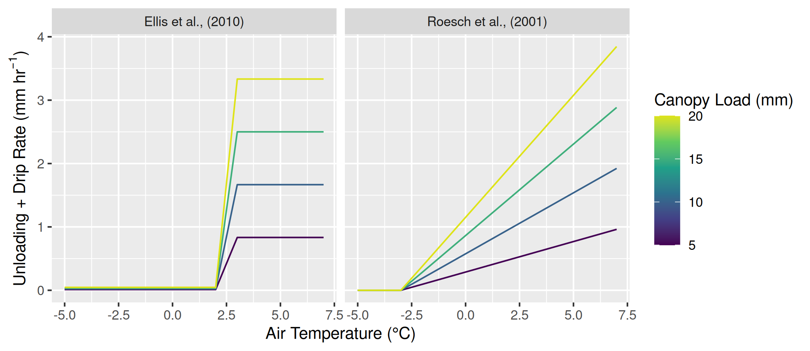

**Authors:**

Alex C. Cebulski^1^ (ORCID ID - 0000-0001-7910-5056)

John W. Pomeroy^1^ (ORCID ID - 0000-0002-4782-7457)

Bill C. Floyd^2,3^

^1^Centre for Hydrology, University of Saskatchewan, Canmore, Canada\
^2^Ministry of Forests, Provincial Government of British Columbia, Nanaimo, British Columbia\
^3^Coastal Hydrology Research Lab, Vancouver Island University, Nanaimo, British Columbia

**Corresponding Author:** A.C. Cebulski, alex.cebulski@usask.ca

\pagebreak


```{r, include=FALSE, warning=FALSE}
knitr::opts_chunk$set(echo = FALSE, message=FALSE, warning=FALSE, fig.align='center')

source('scripts/results/qunld-analysis/00-results-figs-setup.R')
source('scripts/get-manuscript-values.R')
```

# Supporting Information 

## Existing Snow Interception Theories

{#fig-unl-ex-wind}

{#fig-unl-ex-temp}

## Evaluation of Unloading Relationships

```{r tbl-all-mod-summary, echo=FALSE}
#| label: tbl-q-unld-bins-full
#| tbl-cap: "Summary of multiple linear regression results evaluating all combinations of predictor variables for canopy snow unloading including: canopy load ($L$), wind speed ($u$), canopy snowmelt rate ($q_{melt}$), canopy snow sublimation rate ($q_{subl}$), and air temperature ($T_a$). Columns L to Ta show the coefficient estimate for each respective term, and the significance of each term is shown in brackets. Significance codes: * = p < 0.05; ns = not significant (p > 0.05). The models are ranked by their corresponding AIC value."
#| tbl-colwidths: [11, 13, 13, 14, 12, 14, 8, 8]


lm_multi_reg_tbl |> 
  select(`Model Name`,
         intercept,
         L,
         u,
         q_melt,
         q_subl,
         tau,
         # T_ib_dep,
         T_a,
         Adj_R2,
         AIC) |>
  knitr::kable(col.names = c(
  'Model Name',
  'Intercept',
  '$L$',
  '$u$',
  '$q_{melt}$',
  '$q_{subl}$',
  '$\\tau$',
  # '$T_a - T_{ice}$',
  '$T_a$',
  '$R^2$',
  'AIC'
))
```

